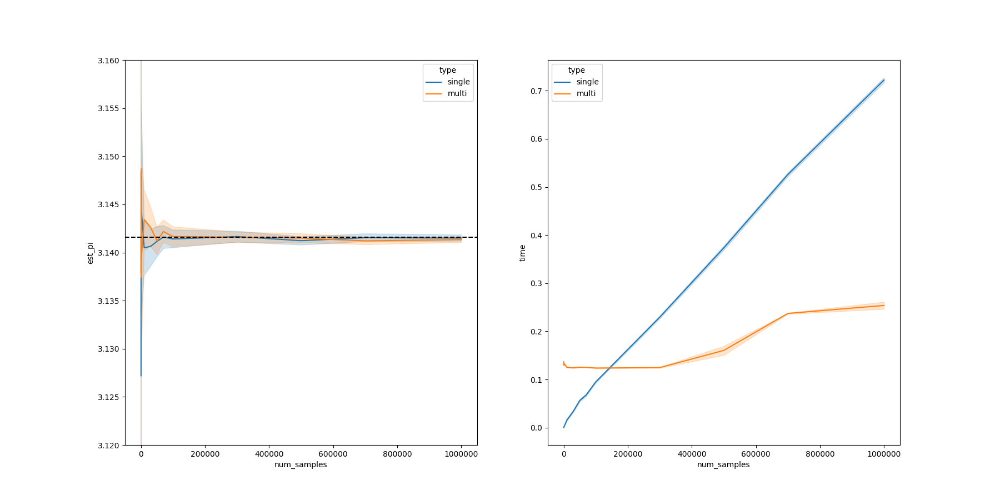

Experimenting with the overhead of multiprocessing and profiling using [viztracer](https://github.com/gaogaotiantian/viztracer)


 (from Wikipedia)

Estimated Pi and time per estimation vs. number of samples. 

"single" means all K samples are run on a single thread. "multi" means the K samples are split evenly over 8 processes and the final estimation is the average of the 8 estimates.
When K >= around 15,000 using multiprocessing can complete K samples faster despite the overhead.

Running viztracer:

1. For the single thread program
```
python profiling_single.py
```

2. For the multi-process program
```
viztracer profiling_multi.py --log_multiprocess --output_file multi_proc_4.html
```

After opening either `.html` files that contain the profiling report, you can search for "uniform" or "random.random" and they should show up 200 times in both files.
These functions are important for the Monte-Carlo Pi estimation function in `estimate_pi.py`.

In the single thread program, there is not much overhead so it is very easy to locate where those functions are called. The litle blue blocks in the image below 
correspond to the "uniform" function - you can see that it almost covers the entire program execution.


However, when profiling the multiprocess program (with 4 processes), it's very hard to see where "uniform" is given all the overhead. Again, the litle blue blocks in the image below 
correspond to the "uniform" function.


